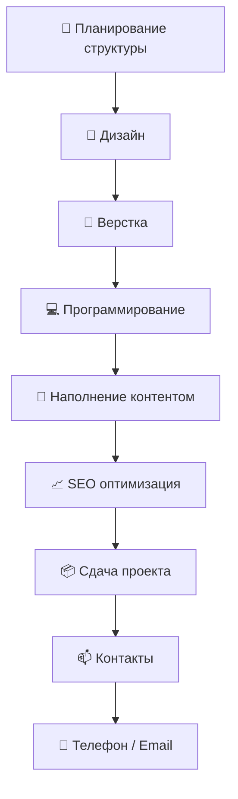

  
  <!-- Анимированная типографика -->
  

  <!-- Анимированный баннер -->
  

## 🎯 Профессиональные бейджи

  
  <!-- GitHub Stats -->
  
  
  <!-- GitHub Streak -->
  
  
  <!-- Трофеи -->
  

## ⚡ Технологии с анимированными иконками

### 🌐 Frontend & CMS

  
  
  
  
  
  

## 🎨 Проекты-избранное

| Проект | Описание | Технологии |
|--------|----------|------------|
| **[🔥 WordPress Магазин](https://рукодер.рф)** | Полный цикл разработки интернет-магазина | WordPress, WooCommerce, PHP, JS |
| **[🤖 Telegram CRM](https://t.me/RussCoder)** | Бот для автоматизации бизнес-процессов | Python, Aiogram, PostgreSQL |
| **[⚡ Быстрый сайт]** | Оптимизированный лендинг за 24 часа | HTML5, CSS3, Vanilla JS |

ыыыы

## 📊 GitHub Stats

  
  

## 📈 Activity Graph

## 🛠️ Tech Stack

  
  
  
  
  
  
  
  
  
  

## 💬 Random Developer Quote

## 📝 Lines of code

  
  

## 🏓 Ping Pong

  

# 👨‍💻 Сергей Солошенко | 🆁🆄🅲🅾🅳🅴🆁

  

  <b>Разработка сайтов с 2018 года | WordPress / Full Stack</b> 
  <i>"Сайт как для себя» — именно так можно обозначить мой главный принцип"</i>

  
  
  
  

## 🐍 Активность GitHub

---

## 🚀 Основные направления
### 🌐 Веб-разработка
- 🛒 Продающие сайты на WordPress/WooCommerce (под ключ)
- 🏗️ Сложные backend-решения любой сложности
- 🔌 Кастомные плагины и модули для WordPress
- 📊 Интерактивные калькуляторы и формы

### 💻 Программная разработка
- 🤖 Telegram-боты (парсеры, CRM, автоматизация)
- 📦 Десктопные приложения (C++/Qt, Python)
- ⚙️ Системные утилиты и скрипты (Python, Bash)
- 🔌 Интеграции с API (1С, Битрикс, AmoCRM)

## 🛠️ Технологический стек
### Frontend & CMS

### Backend & Languages

### DevOps & Tools

---

## 🚀 Обо мне

- 🎯 Специализируюсь на создании продающих сайтов на **WordPress**
- 🔧 Разработка backend логики для сложных проектов
- ⚙️ Full Stack решения: от идеи до запуска
- 👨‍🏫 Консультирую по WordPress/WooCommerce

---

## 🛠️ Мой стек технологий

### 🌐 Frontend & CMS

  
  
  
  
  
  

### ⚙️ Backend

  
  
  
  

---

## 📊 GitHub Статистика

 

---

## 🧠 Процесс разработки

📫 Контакты
📱 Телефон / WhatsApp: +7 (985) 985-53-97
 
📩 Email: support@рукодер.рф
 
⚡ Telegram: @RussCoder
 
🌍 Портфолио: https://рукодер.рф

  

