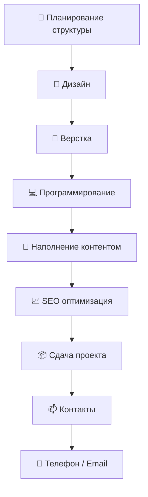

# 👨‍💻 Сергей Солошенко | 🆁🆄🅲🅾🅳🅴🆁

  

  <b>Разработка сайтов с 2018 года | WordPress / Full Stack</b> 
  <i>«Сайт как для себя» — именно так можно обозначить мой главный принцип</i>

  
  
  
  

---

## 🚀 Обо мне

- 🎯 Специализируюсь на создании продающих сайтов на **WordPress**
- 🔧 Разработка backend логики для сложных проектов
- ⚙️ Full Stack решения: от идеи до запуска
- 👨‍🏫 Консультирую по WordPress/WooCommerce

---

## 🛠️ Мой стек технологий

### 🌐 Frontend & CMS

  
  
  
  
  
  

### ⚙️ Backend

  
  
  
  

---

## 📊 GitHub Статистика

  
  

---

## 🧠 Процесс разработки (Mermaid схема)

📫 Контакты
📱 Телефон / WhatsApp: +7 (985) 985-53-97
 
📩 Email: support@рукодер.рф
 
⚡ Telegram: @RussCoder
 
🌍 Портфолио: https://рукодер.рф

  

