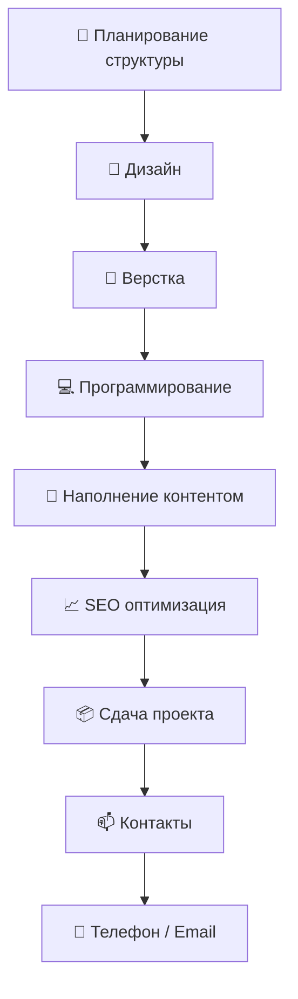

# 👨‍💻 Сергей Солошенко | 🆁🆄🅲🅾🅳🅴🆁

  

  <b>Разработка сайтов с 2018 года | WordPress / Full Stack</b> 
  <i>"Сайт как для себя» — именно так можно обозначить мой главный принцип"</i>

  
  
  
  

## 🐍 Активность

---

## 🚀 Основные направления
### 🌐 Веб-разработка
- 🛒 Продающие сайты на WordPress/WooCommerce (под ключ)
- 🏗️ Сложные backend-решения любой сложности
- 🔌 Кастомные плагины и модули для WordPress
- 📊 Интерактивные калькуляторы и формы

### 💻 Программная разработка
- 🤖 Telegram-боты (парсеры, CRM, автоматизация)
- 📦 Десктопные приложения (C++/Qt, Python)
- ⚙️ Системные утилиты и скрипты (Python, Bash)
- 🔌 Интеграции с API (1С, Битрикс, AmoCRM)

## 🛠️ Мой технологий стек

### 🌐 Frontend & CMS

  
  
  
  
  
  
  

### Backend & Languages

  
  
  
  

### DevOps & Tools

---

## 🚀 Обо мне

- 🎯 Специализируюсь на создании продающих сайтов на **WordPress**
- 🔧 Разработка backend логики для сложных проектов
- ⚙️ Full Stack решения: от идеи до запуска
- 👨‍🏫 Консультирую по WordPress/WooCommerce

---

## 📊 GitHub Статистика

 

---

## 🧠 Процесс разработки

## 🎨 Всегда на связи

| Проект | Описание | Технологии |
|--------|----------|------------|
| **[🔥 WordPress Магазин](https://рукодер.рф)** | Полный цикл разработки интернет-магазина | WordPress, WooCommerce, PHP, JS |
| **[🤖 Telegram CRM](https://t.me/RussCoder)** | Бот для автоматизации бизнес-процессов | Python, Aiogram, PostgreSQL |
| **[⚡ Быстрый сайт]** | Оптимизированный лендинг за 24 часа | HTML5, CSS3, Vanilla JS |

## 📫 Контакты

📱 Телефон / WhatsApp: +7 (985) 985-53-97
 
📩 Email: support@рукодер.рф
 
⚡ Telegram: @RussCoder
 
🌍 Портфолио: https://рукодер.рф

## 😎 Цитата

  

    

      Основная проблема при разработки заключается в том, что при исправлении одного дефекта с большой вероятностью (20-50 %) появляется другой. Таким образом, весь процесс - это два шага вперед и один шаг назад.
    

    

      - Закон Леханской
    

  

  

