# 👨‍💻 Сергей Солошенко | 🆁🆄🅲🅾🅳🅴🆁

  

  <b>Разработка сайтов с 2018 года | WordPress / Full Stack</b> 
  <i>"Сайт как для себя» — именно так можно обозначить мой главный принцип"</i>

  
  
  
  

---

## 🚀 Основные направления
### 🌐 Веб-разработка
- 🛒 Продающие сайты на WordPress/WooCommerce (под ключ)
- 🏗️ Сложные backend-решения любой сложности
- 🔌 Кастомные плагины и модули для WordPress
- 📊 Интерактивные калькуляторы и формы

### 💻 Программная разработка
- 🤖 Telegram-боты (парсеры, CRM, автоматизация)
- 📦 Десктопные приложения (C++/Qt, Python)
- ⚙️ Системные утилиты и скрипты (Python, Bash)
- 🔌 Интеграции с API (1С, Битрикс, AmoCRM)

## 🛠️ Технологический стек
### Frontend & CMS

### Backend & Languages

### DevOps & Tools

---

## 🚀 Обо мне

- 🎯 Специализируюсь на создании продающих сайтов на **WordPress**
- 🔧 Разработка backend логики для сложных проектов
- ⚙️ Full Stack решения: от идеи до запуска
- 👨‍🏫 Консультирую по WordPress/WooCommerce

---

## 🛠️ Мой стек технологий

### 🌐 Frontend & CMS

  
  
  
  
  
  

### ⚙️ Backend

  
  
  
  

---

## 📊 GitHub Статистика

 

---

## 🧠 Процесс разработки

```mermaid
graph TD
  A["🧠 Планирование структуры"] --> B["🎨 Дизайн"]
  B --> C["🧱 Верстка"]
  C --> D["💻 Программирование"]
  D --> E["📝 Наполнение контентом"]
  E --> F["📈 SEO оптимизация"]
  F --> G["📦 Сдача проекта"]
  G --> H["📫 Контакты"]
  H --> I["📱 Телефон / Email"]
```

📫 Контакты
📱 Телефон / WhatsApp: +7 (985) 985-53-97
 
📩 Email: support@рукодер.рф
 
⚡ Telegram: @RussCoder
 
🌍 Портфолио: https://рукодер.рф

  

